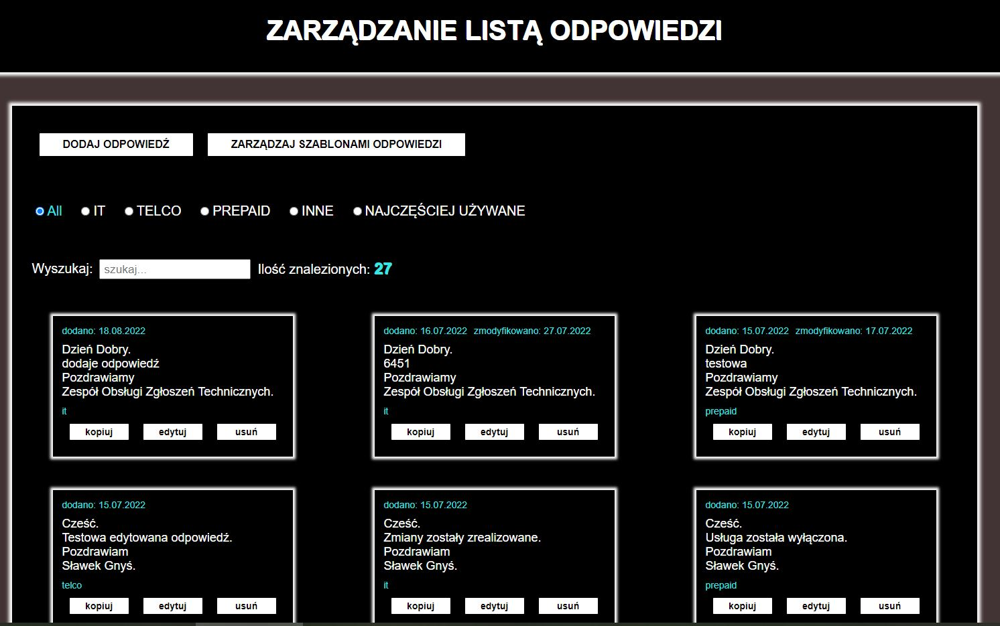
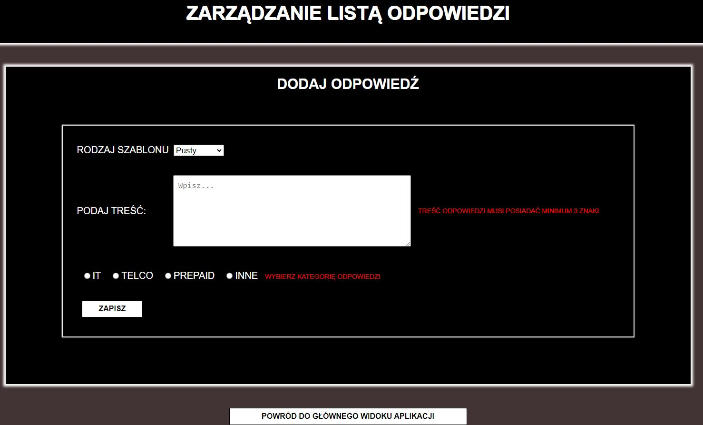
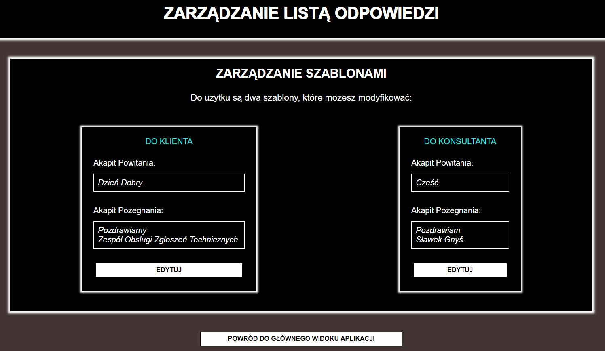
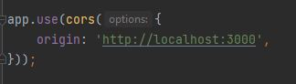

<!--
Hey, thanks for using the awesome-readme-template template.  
If you have any enhancements, then fork this project and create a pull request 
or just open an issue with the label "enhancement".
Don't forget to give this project a star for additional support ;)
Maybe you can mention me or this repo in the acknowledgements too
-->


  <h1>Readme</h1>


<br />

<!-- Table of Contents -->
# :notebook_with_decorative_cover: Table of Contents

- [About the Project](#star2-about-the-project)
    * [Screenshots](#camera-screenshots)
    * [Tech Stack](#space_invader-tech-stack)
    * [Features](#dart-features)
    * [Environment Variables](#key-environment-variables)
- [Getting Started](#toolbox-getting-started)
    * [Prerequisites](#bangbang-prerequisites)
    * [Installation](#gear-installation)
    * [Run Locally](#running-run-locally)
    * [Deployment](#triangular_flag_on_post-deployment)
    * [Testing](#triangular_flag_on_post-testing)
- [Roadmap](#compass-roadmap)
- [Contact](#handshake-contact)


<!-- About the Project -->
## :star2: About the Project

<br/>* Stworzona aplikacja ułatwi mi wykonywanie obowiązków w obecnej pracy. Obecnie Pracuję na I Linii Service Desk. Obsługuję zgłoszenia techniczne dla firmy telekomunikacyjnej. Dziennie to kilkadziesiąt takich zgłoszeń- często powtarzalnych.

Jeśli uda mi się rozwiązać problem, to przy zamknięciu zgłoszenia mam obowiązek udzielenia odpowiedzi w Service Desk. Jedno rozwiązanie zgłoszenia technicznego musi zawierać odpowiedź do Konsultanta, który wysyła zgłoszenie a druga odpowiedź jest kierowana do Klienta jako wiadomość SMS.

Aplikacja umożliwia tworzenie takich odpowiedzi a później ich wyszukiwanie po tekście. Odpowiedź można usuwać, edytować jak i również kopiować do schowka, zmieniać ich kategorię oraz zastosowane szablony.

Często odpowiedź do Konsultanta i do Klienta jest podobna ale forma przywitania i pożegnania jest inna. Dlatego zostały stworzone dwa szablony: Do Klienta i Do Konsultanta. Można je też modyfikować Nie wybranie żadnego szablonu podczas tworzenia odpowiedzi traktuje jako własną notatkę.

Odpowiedzi można kategoryzować według kategorii: IT, TELCO, PREPAID, INNE oraz NAJCZĘŚCIEJ UŻYWANE. „NAJCZĘŚCIEJ UŻYWANE” – tutaj za podnoszenie wartości odpowiada wybranie przycisku „kopiuj” w danej odpowiedzi.
<br/>* App is still in development, right now has basic features implemented.
<br/>* Check roadmap to see an incoming changes...
<br/>* Check the features to see implemented functionalities.
<h3>Preview</br></h3>
<br/>* Preview available: https://www.answers-app.networkmanager.pl/
<br/>* Frontend Repo : https://github.com/sgnys/AnswersAppFront
<br/>* DataBase file for Import purpose  : https://github.com/sgnys/AnswersAppBack/tree/main/DataBaseScheme
<h2>Please Check Frontend repo to find out more about it :)</h2></br>

<!-- Screenshots -->
### :camera: Screenshots


  
  
  


<!-- TechStack -->
### :space_invader: Tech Stack

<details>
  <summary>Client</summary>
  <ul>
    <li><a href="https://www.typescriptlang.org/">Typescript</a></li>
    <li><a href="https://reactjs.org/">React.js</a></li>

  </ul>
</details>

<details>
  <summary>Server</summary>
  <ul>
    <li><a href="https://www.typescriptlang.org/">Typescript</a></li>
    <li><a href="https://expressjs.com/">Express.js</a></li>
    <li><a href="https://www.mysql.com/">MySql</a></li>

  </ul>
</details>

<details>
<summary>Database</summary>
  <ul>
    <li><a href="https://www.mysql.com/">MySQL</a></li>
  </ul>
</details>


<!-- Features -->
### :dart: Features

* [x] Creating a new answer.
* [x] Editing answer.
* [x] Deleting answer.
* [x] Managing existing answers templates.
* [x] Sorting answers by categories.
* [x] Searching answers.
* [x] Copying answer.

Check the Roadmap to find an incoming features!

<!-- Env Variables -->
### :key: Environment Variables
* In index.ts file please set correct path to let client side connect with API
<div> 

  

<h3>To run locally make sure backend is listening and database is implemented correctly.
</div>

<!-- Getting Started -->
## 	:toolbox: Getting Started

<!-- Prerequisites -->
### :bangbang: Prerequisites

This project uses NPM as package manager

```bash
 npm install -g npm
```

<!-- Installation -->
### :gear: Installation

Install my-project with npm

```bash
  npm install my-project
  cd my-project
```


<!-- Run Locally -->
### :running: Run Locally

Clone the project

```bash
  git clone https://github.com/sgnys/AnswersAppBack.git
```

Go to the project directory

```bash
  cd AnswersAppBack
```

Install dependencies

```bash
  npm install
```

Start the server

```bash
  npm run start:dev
```

<!-- Deployment -->
### :triangular_flag_on_post: Deployment

To deploy this project run

```bash
  npm run build
```

<!-- Testing -->
### :triangular_flag_on_post: Testing

To use tests

```bash
  npm run test
```


<!-- Roadmap  -->
## :compass: Roadmap

* [x] Basic functionality (check features section)
* [x] Linux Server Host Preview
* [ ] Backend in NestJS
* [ ] User registration system


<!-- Contact -->
## :handshake: Contact

Sławomir Gnyś  - gnys1001@gmail.com